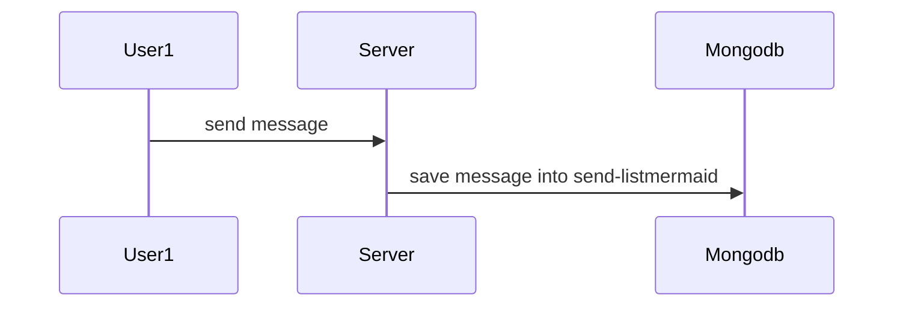
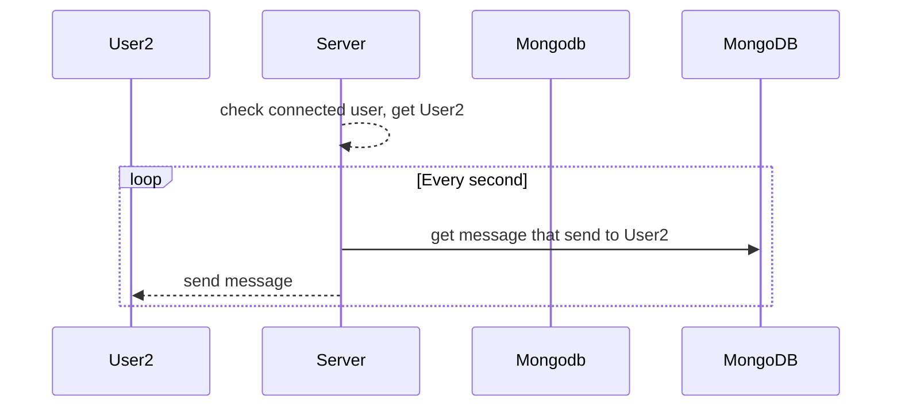

## Running the app

```bash
# development
$ pnpm run start

# watch mode
$ pnpm run start:dev

# production mode
$ pnpm run start:prod
```

## Test

```bash
# unit tests
$ pnpm run test

# e2e tests
$ pnpm run test:e2e

# test coverage
$ pnpm run test:cov
```

## websocket 连接数限制

单机最大连接数为 6w+ 个，取决于可使用的端口数

> 根据TCP/IP协议，由于端口是16位整数，也就只能是0到 65535，而0到1023是预留端口，所以能分配的端口只是1024到65534，也就是64511个。也就是说，一台机器一个IP只能创建六万多个websocket长连接。

关键参数：

- 全局最大连接数 `sysctl kern.maxfiles`

- 单进程最大连接数 `sysctl kern.maxfilesperproc`

- 最大文件描述符 `ulimit -n`

- 端口分配配置 `sysctl net.inet.ip.portrange`

## 消息通知机制
通信人在线的情况下，可以直接采用 socket.to(roomid) 的方式，群发信息

如果要给离线的用户发送消息，则需要采用消息队列的方式，先将发送方的数据存到消息队列里，再根据接收方的连接状态，异步从消息队列里获取接收方的信息，发送给接收方。

流程示意图如下：





## 多进程部署
多进程部署的情况下，socket 还需要借助数据库/中间服务，来实现跨服务器消息同步
参考：
- Redis 接入：https://socket.io/docs/v4/redis-adapter/
- MongoDB 接入：https://socket.io/docs/v4/mongo-adapter/
- 中间进程接入：https://socket.io/docs/v4/cluster-adapter/
